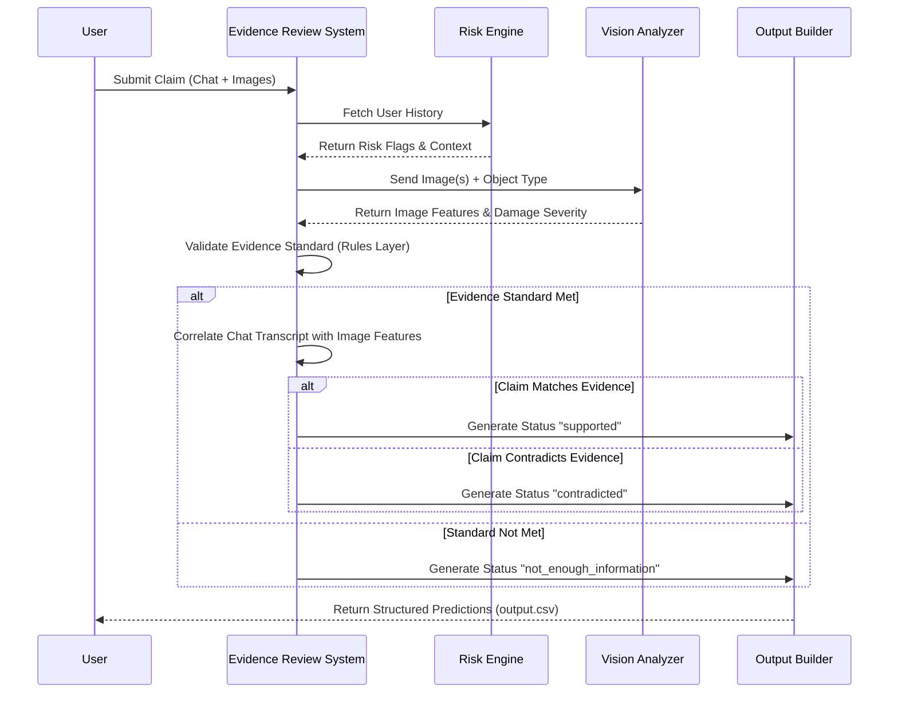

# 🚀 HackerRank Orchestrate (June 2026)!

<div align="center">
  
  
  
</div>

<br />

Welcome to the ultimate **Multi-Modal Evidence Review System** built for the HackerRank Orchestrate 24-hour hackathon! This project seamlessly verifies damage claims using a combination of image evidence, user chat transcripts, and historical risk contexts.

## 🌟 Approach & Architecture
Our system leverages advanced visual and linguistic models to accurately cross-reference user claims against actual submitted imagery.

**Core Highlights:**
- **Dynamic Risk Engine:** Evaluates past user behavior alongside current claims to flag potential anomalies.
- **Vision Analyzer:** Extracts key features from images to check for specific object parts and visible damage.
- **Intelligent Evaluation Workflow:** Correlates chat logs and visual cues to yield a definitive status: `supported`, `contradicted`, or `not_enough_information`.

## 🔄 Execution Sequence Diagram

Here is an end-to-end flow of how the system processes a user claim:



## 🛠️ Quick Setup Instructions

1. **Clone & CD:**
   ```bash
   git clone git@github.com:interviewstreet/hackerrank-orchestrate-june26.git
   cd hackerrank-orchestrate-june26
   ```

2. **Environment Setup:**
   Ensure you have your environment variables ready:
   ```bash
   cp code/.env.example code/.env
   # Add your API keys to the .env file
   ```

3. **Install Dependencies:**
   ```bash
   cd code
   pip install -r requirements.txt
   ```

4. **Run the Solution:**
   ```bash
   python main.py
   ```

5. **Evaluate:**
   ```bash
   python evaluation/main.py
   ```

## 📈 Evaluation & Results
All evaluations are documented and thoroughly analyzed inside the `code/evaluation/evaluation_report.md` file.

Made with ❤️ and extreme engineering by the Developer.
